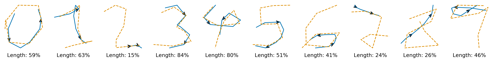
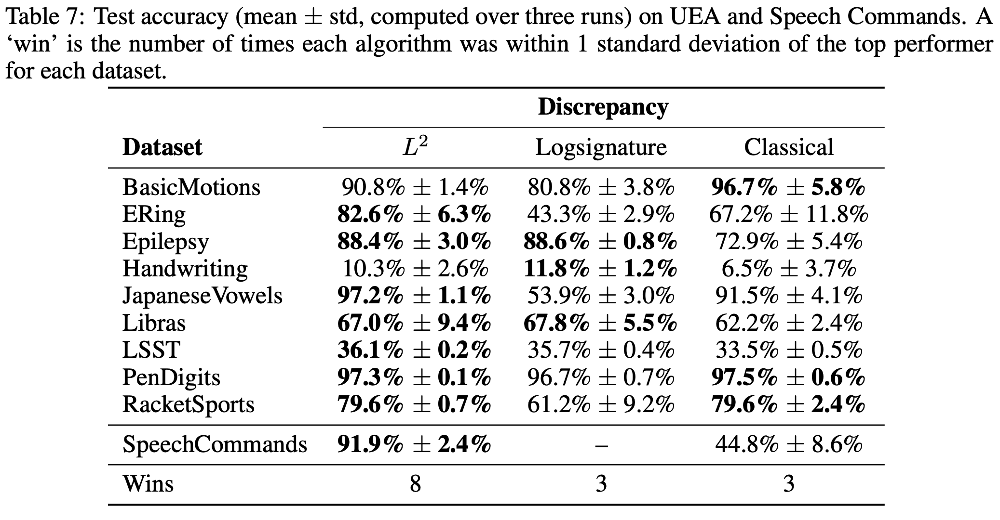
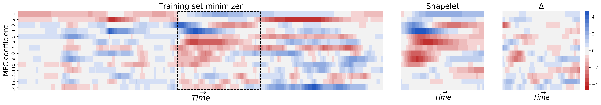
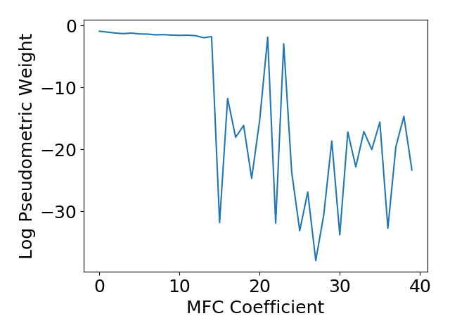

<h1 align='center'> Generalised Interpretable Shapelets for Irregular Time Series 
    [<a href="https://arxiv.org/abs/TODO">arXiv</a>] </h1>

A generalised approach to _the shapelet method_ used in time series classification, in which a time series is described by its similarity to each of a collection of 'shapelets'. Given lots of well-chosen shapelets, then you can now look at those similarities and conclude that "This time series is probably of class X, because it has a very high similarity to shapelet Y."

We extend the method by:
+ Extending to irregularly sampled, partially observed multivariate time series.
+ Differentiably optimising the shapelet lengths. (Previously a discrete parameter.)
+ Imposing interpretability via regularisation.
+ Introducing generalised discrepancy functions for domain adaptation.

This gives a way to classify time series, whilst being able to answer questions about why that classification was chosen, and even being able to give new insight into the data. (For example, we demonstrate the discovery of a kind of spectral gap in an audio classification problem.)

Despite the similar names, shapelets have nothing to do with wavelets.

----
## Library
We provide a PyTorch-compatible library for computing the generalised shapelet transform [here](./torchshapelets).

## Some Results
Accuracies on a collection of datasets:

The first 14 MFC coefficients for an audio recording from the Speech Commands dataset, along with the learnt shapelet, and the difference between them.:

Interpreting why a class was chosen based on similarity to a shapelet:

Using a pseudometric uncovers a spectral gap in an audio classification problem:

## Citation

## Reproducing the experiments

### Requirements
+ python==3.7.4
+ numpy==1.18.3
+ scikit-learn==0.22.2
+ six==1.15.0 
+ scipy==1.4.1
+ sktime==0.3.1 
+ torch==1.4.0
+ torchaudio==0.4.0 
+ tqdm==4.46.0
+ signatory==1.2.0.1.4.0        [This must be installed _after_ PyTorch]

The following are also needed if you wish to run the interpretability notebooks:
+ jupyter==1.0.0          
+ matplotlib==3.2.1
+ seaborn==0.10.1

Finally, the `torchshapelets` package (in this repository) must be installed via:
``python torchshapelets/setup.py develop``

### Downloading the data
+ ``python get_data/uea.py``
+ ``python get_data/speech_commands.py``

### Running the experiments
First make a folder at `experiments/results`, which is where the results of the experiments will be stored. Each model is saved after training for later analysis, so make this a symlink if you need to save on space. All experiments can be run via:
+ ``python experiments/uea.py <argument>``
+ ``python experiments/speech_commands.py``

where ``<argument>`` is one of:
+ ``all``: run every experiment. Not recommended, will take forever.
+ ``hyperparameter_search_old``: do hyperparameter searches for the performance of the classical shapelet transform on the UEA datasets.
+ ``hyperparameter_search_l2``: do hyperparameter searches for the performance of the generalised shapelet transform on the UEA datasets with missing data.
+ ``comparison_test``: actually use the hyperparameter searches (hardcoded to the results we found) for the UEA comparison between classical and generalised shapelets.
+ ``missing_and_length_test``: actually use the hyperparameter searches (hardcoded to the results we found) for the test about learning lengths and missing data.
+ ``pendigits_interpretability``: run models for just PenDigits, and then save the resulting shapelets.

However due to the high memory cost, we do not advise attempting this in one go and instead suggest using the scripts as a guide to understand how experiments are run, and only running a subset of experiments that are of most interest.

### Model evaluation
Once an experiment has been completed, model performance can be viewed using the `experiments/parse_results.py` script. Simply run the file with an argument that corresponds to the name of a folder in `experiments/results`. For example, suppose we have run the UEA comparison test, then results can be viewed by running:
+ `python experiments/parse_results.py uea_comparison`
